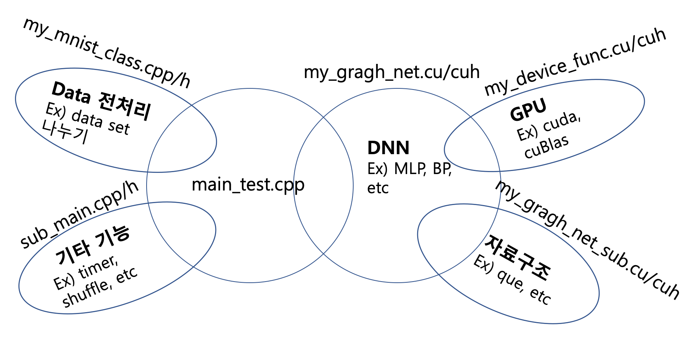
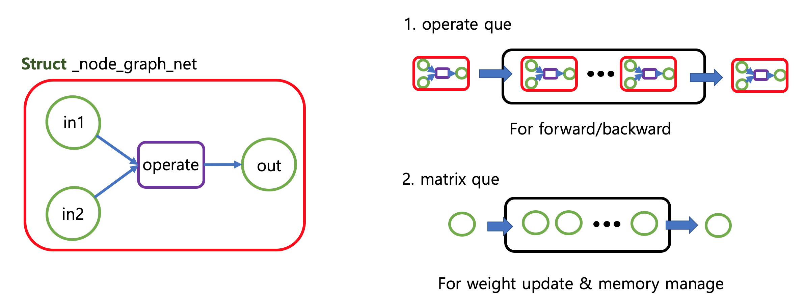

# My cuda code for comparaing with tensorflow


- 작성 날짜 : 2019.9.11
- 프로젝트 기간 : 2017.9 ~ 2017.11
- 개발환경 :
  - Ubuntu 16.04.5 LTS
  - python 3.5.2
  - tensorflow 1.6.0
  - cuda 9.0
  - TATAN X (Pascal) 12GB
- 소개
  - 본 문서는 저의 개발 역량을 보여주는 것이 목적입니다. 따라서 이 코드는 제가 직접 작성한 것입니다.   
  -


- cuda code 파일
  ```
  graph_structure_v2
      |-- my_device_function.cu/cuh : cuda 관련 코드
      |-- my_gragh_net_sub.cu/cuh : 자료구조 관련 코드
      |-- my_mibist_class.cpp/h : mnist data 관련 코드
      |-- sub_main.cpp/h : 기타 기능 코드
      |-- main_test.cpp : main 실행문
      |-- compare.py : tensorflow 코드  
  ```

- cuda code 파일 간 관계
   
    - 각 파일 간의 관계는 위의 벤 다이어그램과 같습니다. 서로 교집합이 있는 곳의 기능이 수정이 된다면, 두 파일이 수정되야 됨을 의미합니다.

- cuda code 자료구조
  
  - 오른쪽의 그림은 본 알고리즘의 기본 structure이다. 두 개의 입력값과 출력값, 함수 포인터로 이루어져 있다. 기본적으로 입력값과 출력값은 행렬로 이루어져 있다. 이러한 기본 구조는 딥러닝에 쓰이는 모든 연산을 만들 수 있다. 기본 structure로 네트워크를 만들면 왼쪽의 그림과 같이 두개의 que에 자료형이 저장된다. operate que는 forward/backward 연산을 하기 위한 것이고, matrix que는 weight update와 memory manage를 위한 자료구조이다.

- 실험 결과

| |my cude code|tensorflow|
|------|---|---|
|total time|약 45초|약 52초 |
|total memory|약 400MB|약 500MB|
|code 작성 시간|몇 일|몇 분|

- 결론
tensorflow code보다 직접 작성한 cuda code가 속도와 메모리 측면에서 더 효율적이었으나, 생산성을 생각하면 tensorflow code로 작성하는 것이 더 효율적일 것이다.
